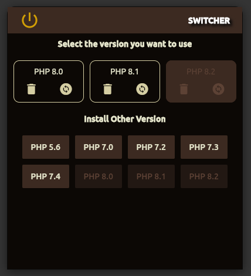

# switcher

A Flutter project for Ubuntu to switch between PHP versions.

## Ideology
After spending a few years in web development using Laravel and using Ubuntu as my OS, I came accross an issue where I need to switch between PHP versions. Whenever I need to switch back and forth, I have to run a command and the select the prefered version. So I thought why don't we just have a GUI application which can do the same and here is the result. It is not the best, beautiful UI but it does what it supposed to do. 😁

## Screenshot

  

